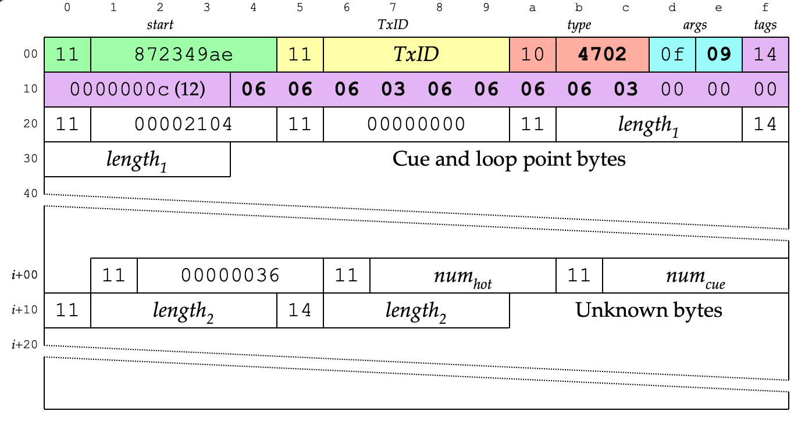

# bytefield-svg

A Node module for generating byte field diagrams like
[this one](https://deepsymmetry.org/images/test.svg).
Inspired by the LaTeX [`bytefield`](https://ctan.org/pkg/bytefield?lang=en)
package. Powered by a [Clojure](https://clojure.org)-based
[domain specific language](https://bytefield-svg.deepsymmetry.org/)
(now built on top of [SCI](https://github.com/borkdude/sci), the
Small Clojure Interpreter).

[](#license)

<a href="https://deepsymmetry.org/images/test.svg"></a>

## Usage

This is published to npm, so you can install it for use in a Javascript
project by running:

    npm install bytefield-svg

Or you can install it globally for use anywhere by running:

    npm install -g bytefield-svg

The language you use to create diagrams has its own
[documentation site](https://bytefield-svg.deepsymmetry.org/).

### Invoking from Javascript

Once installed, you can generate diagrams in your code like this:

```javascript
const generate = require('bytefield-svg');

const source = `
;; Put your diagram DSL here, or read it from a file, or build it...
`;
const diagram = generate(source);
process.stdout.write(diagram);
```

By default, a full SVG file is generated, complete with XML version
and namespaces. If you want to generate a simple `<svg>` tag which is
suitable for embedding inside an HTML document, you can request that
by calling `generate` like this:

```javascript
// setup code omitted...
const diagram = generate(source, { "embedded": true });
```

Of course, you can do other things than writing the diagram to standard out.
For a few more examples of usage, you can see the
[cli.js](https://github.com/Deep-Symmetry/bytefield-svg/blob/master/cli.js)
source in this project which implements the command-line interface, our next
topic:

### Invoking from the Command Line

This package also installs a command-line tool. If you have installed it
globally, you can simply invoke it as `bytefield-svg`. If you have installed
it locally, you can invoke it using `npx bytefield-svg` within your project.

With no arguments, the tool will read the diagram source from standard in, and
write it to standard out. So you can generate the example diagram from this
Read Me, as long as you have the [`test.edn`
file](https://github.com/Deep-Symmetry/bytefield-svg/blob/master/test.edn),
by running:

    bytefield-svg <test.edn >test.svg

You can also use the `-s` or `--source` command-line argument to specify
that the tool should read from a named file rather than standard in, and
`-o` or `--output` to write to a named file rather than standard out, which
might be helpful in a scripting pipeline:

    bytefield-svg --source test.edn --output test.svg

If you supply just a filename with no command-line flag, it is assumed
to be the diagram source file.

Normally the output is a full SVG file, complete with XML version
information and namespaces. If instead you want to generate a simple
SVG tag which is suitable for embedding inside an HTML document, you
can supply the `-e` or `--embedded` flag.

Invoking it with `-h` or `--help` displays this usage information.

    -h, --help            Display this usage guide.
    -s, --source string   File from which to read the diagram source, defaults to
                          standard in.
    -o, --output string   File to which to write the SVG diagram, defaults to
                          standard out.
    -e, --embedded        Emit a simple <svg> tag suitable for embedding in an
                          HTML document. (The default is to emit a full SVG file
                          with XML version and namespaces.)

## Getting Help

<a href="https://zulip.com"></a>

Deep Symmetry&rsquo;s projects are generously sponsored with hosting
by <a href="https://zulip.com">Zulip</a>, an open-source modern team
chat app designed to keep both live and asynchronous conversations
organized. Thanks to them, you can <a
href="https://deep-symmetry.zulipchat.com/#narrow/stream/354684-other-projects">chat
with our community</a>, ask questions, get inspiration, and share your
own ideas.

## Background

The DSL has been nicely validated by porting all of the LaTeX
documents I needed it for to an [Antora documentation
site](https://djl-analysis.deepsymmetry.org/djl-analysis/track_metadata.html).

As that site suggests, this package&rsquo;s main purpose is to act as
an [Asciidoctor](https://asciidoctor.org) extension, and in fact
[asciidoctor-bytefield](https://github.com/Deep-Symmetry/asciidoctor-bytefield)
has now been published to enable that.

## Building

To build a development build of `bytefield-svg` from source, clone the
repository and make sure you have [Node.js](https://nodejs.org/en/)
and the [Clojure CLI
tools](https://clojure.org/guides/getting_started) installed, then
from the top-level directory of your cloned repo run:

    npm install
    npm run build

This will create the file `lib.js`. At that point, you can generate
[the sample diagram](https://deepsymmetry.org/images/test.svg) by running:

    node cli.js test.edn >test.svg

(The [`test.edn`
file](https://github.com/Deep-Symmetry/bytefield-svg/blob/master/test.edn)
is present in this project. It renders a diagram from the above-linked
documentation site. With some well-designed helper functions in
site&rsquo;s own include file, the source for an even more attractive
version of the diagram shrinks to
[this](https://github.com/Deep-Symmetry/dysentery/blob/379555f21244354c4dc0c9711c8cb3a3552bc64b/doc/modules/ROOT/examples/dbserver_shared.edn)).

The [DSL documentation](https://bytefield-svg.deepsymmetry.org/) is
hosted on deepsymmetry.org, and built out of the [doc](doc) folder,
which includes build instructions. (They are slightly more complex
than if you were using `asciidoctor-bytefield`, because they want to
build against the latest version of `bytefield-svg` in case they are
demonstrating unreleased features that haven&rsquo;t yet made it to
the that extension.)

To check for outdated dependencies, you can run:

    clojure -M:outdated

## Releasing

To cut a release, check for outdated dependencies as above, update the
version in `package.json`, tag and push to GitHub, then run:

    npm install
    npm run release
    npm publish

## License

<a href="https://deepsymmetry.org"></a>

Copyright © 2020–2023 [Deep Symmetry, LLC](https://deepsymmetry.org)

Distributed under the [Eclipse Public License
2.0](https://opensource.org/licenses/EPL-2.0). By using this software
in any fashion, you are agreeing to be bound by the terms of this
license. You must not remove this notice, or any other, from this
software.
